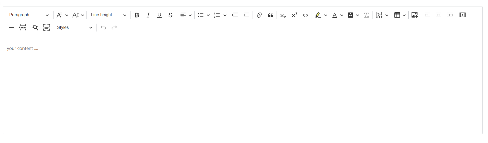

# CKEditor5 + Nuxt 4

A custom **CKEditor 5** integration built with **Nuxt 4**.  
This project provides a fully featured rich text editor with advanced formatting, media support, tables, image upload, and developer-friendly configuration.

The editor is designed for modern web applications that require powerful content editing capabilities.

---

## Preview



---

## Features

- Full integration with **Nuxt 4**
- Rich text editing
- Advanced typography controls
- Custom toolbar configuration
- Image upload and image tools
- Tables with resizing and properties
- Media embedding
- Code blocks
- Autosave
- Word count
- Find and replace
- Paste from Microsoft Office

---

## Image Capabilities

This editor includes advanced image tools:

- Image Upload
- Image Caption
- Image Resize
- Image Styles
- Image Toolbar
- Image Alt Text
- Image Insert

---

## Included Plugins
```txt
Style
Essentials
Paragraph
Heading
Bold
Italic
Underline
Strikethrough
Code
Subscript
Superscript
GeneralHtmlSupport
Indent
IndentBlock
FontFamily
FontSize
FontColor
FontBackgroundColor
Highlight
Alignment
Link
List
ListProperties
Table
TableToolbar
TableProperties
TableCellProperties
TableColumnResize
Image
ImageToolbar
ImageCaption
ImageStyle
ImageResize
ImageUpload
ImageInsert
ImageTextAlternative
MediaEmbed
BlockQuote
CodeBlock
HorizontalLine
PageBreak
FileRepository
Autoformat
Autosave
FindAndReplace
WordCount
PasteFromOffice
RemoveFormat
SelectAll
UploadAdapterPlugin
FontSizeInput
LineHeightDropdown

##Toolbar Configuration
heading
|
fontFamily
fontSize
fontSizeInput
|
lineHeight
|
bold
italic
underline
strikethrough
|
alignment
|
bulletedList
numberedList
|
indent
outdent
|
link
blockQuote
|
subscript
superscript
code
|
highlight
fontColor
fontBackgroundColor
removeFormat
|
codeBlock
|
insertTable
|
imageUpload
|
imageStyle:inline
imageStyle:block
imageStyle:side
|
mediaEmbed
|
horizontalLine
pageBreak
|
findAndReplace
selectAll
|
style
|
undo
redo


## Setup

Make sure to install dependencies:

```bash
# npm
npm install

# pnpm
pnpm install

# yarn
yarn install

# bun
bun install
```


# bun
bun run preview
```

Check out the [deployment documentation](https://nuxt.com/docs/getting-started/deployment) for more information.
